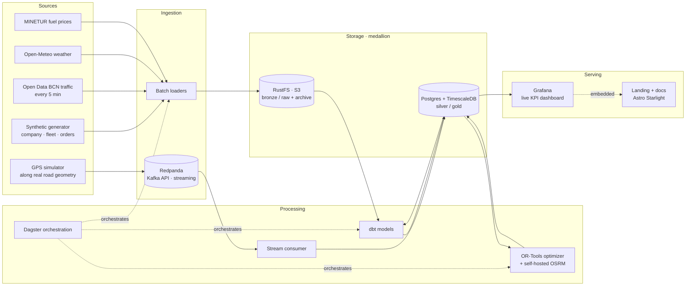

# Datacycle · Logistics Route Optimization

> **Design the Data Lifecycle of a Real Company** — Case 3, Logistics (Route Optimization).
> Datacycle · Unit 1 · DAW2 2026-27.

A working, end-to-end data platform for **Llobregat Express**, a fictional Barcelona last-mile
parcel carrier modeled on Spain's large parcel networks, that re-plans delivery routes in real
time. Everything in this repository runs with a single
`docker compose up`, and every diagram in the documentation describes something that actually
executes.

**Lineage KPI:** *Average Delivery Time per Route* — for each route, the time from the vehicle
leaving the hub until its last delivery is completed, averaged over a time window and segmented
by zone and hour of day. Two supporting KPIs give it context: *average delay vs. plan* and
*share of deliveries inside the promised time window*.

## Architecture at a glance



## How the assignment maps to this repository

| Phase | Deliverable | Where |
|---|---|---|
| 1 · Practical case | Company profile, data inventory | `docs/phases/1-case.md` |
| 2 · Data classification | Structured / semi-structured / unstructured, justified | `docs/phases/2-classification.md` |
| 3 · DIKW | GPS ping → information → knowledge → action | `docs/phases/3-dikw.md` |
| 4 · Data lifecycle | Generation → ingestion → storage → processing → analysis → action → archiving | `docs/phases/4-lifecycle.md` + `docker-compose.yml` |
| 5 · Metadata and lineage | Lineage diagram, dbt-generated lineage graph, 3 mandatory metadata elements | `docs/phases/5-metadata-lineage.md` + dbt docs |
| 6 · Presentation | Slides, live demo script | `slides/` |
| AI-generated data | Every prompt used, versioned, with model and date | `prompts/` |

## Stack

| Layer | Choice | Why |
|---|---|---|
| Streaming ingestion | Redpanda (Kafka API) | Full Kafka semantics in one container, with a web console |
| Batch ingestion | Python loaders scheduled by Dagster | Nightly history, hourly external APIs |
| Raw storage + archive | RustFS (S3 API) | Bronze layer and retention policies for the archiving phase (ADR 0003) |
| Serving storage | PostgreSQL + TimescaleDB | Relational model plus time series for GPS |
| Transformation | dbt | Silver/gold models and an auto-generated lineage graph |
| Orchestration | Dagster | Asset graph, run history, metadata per table |
| Route optimization | Google OR-Tools + self-hosted OSRM | Real vehicle-routing solver over real road distances |
| Dashboard | Grafana | Live map, KPI, before/after optimizer panels |
| Landing and docs | Astro Starlight on GitHub Pages | One site for the pitch and the full write-up |
| Runtime hosting | GitHub Codespaces | Zero cost, public port forwarding for the live demo (ADR 0002) |
| Diagrams | Mermaid | Versioned, renders on GitHub and in the docs |

Real external data (traffic, weather, road geometry, fuel prices) comes from free open sources
verified in [`docs/research/open-data-sources.md`](docs/research/open-data-sources.md).
Business data (company, fleet, drivers, orders, delivery notes, route history) is generated with
AI; the prompts live in [`prompts/`](prompts/). Proof-of-delivery photos are synthetic placeholders
drawn by code.

## Quick start

You need Docker with Compose v2 and about 4 GB of free RAM. On GitHub, **Code → Codespaces →
Create codespace** gives you a machine with everything installed (ADR 0002).

```bash
make up      # creates .env from .env.example, builds and starts everything, waits until healthy
make smoke   # checks that every service answers and does its job
make ps      # services, health and URLs
make down    # stop, keep the data
```

The first `make up` downloads the Catalonia road network (258 MB) and builds the routing graph,
which takes about ten minutes. Later starts take under a minute.

With the platform up, load the reference data, generate orders
([generator](services/generator/README.md)), plan the day's routes and drive them
([simulator](services/simulator/README.md)):

```bash
make load-reference             # hub, zones, fleet, drivers, shippers, delivery notes and real addresses into bronze
make generate DATE=2026-09-28   # one day of orders: a Parquet file in RustFS and rows in bronze.orders
make pod-sample DATE=2026-09-28 # 20 proof-of-delivery placeholder photos of that day, with EXIF, in RustFS
make plan DATE=2026-09-28       # the baseline route plan of that day: 30 morning and 10 afternoon routes
make simulate DATE=2026-09-28   # the vans drive it: GPS, telemetry and handheld scans to Redpanda, at 60x
```

The [stream consumer](services/consumer/README.md) runs with the platform and writes the three
topics into `bronze.gps_pings`, `bronze.vehicle_telemetry` and `bronze.delivery_events` as the vans
send them, with its lag in `ops.consumer_lag` and what it cannot store in `ops.dead_letters`.

Measured on 28 September 2026 with every service idle:

| Resource | Use |
|---|---|
| RAM, nine running services | 1.8 GB |
| RAM, one-off road-graph build | 1.5 GB peak on top, for about 10 minutes |
| RAM, stream consumer, added on 29 September 2026 after it wrote a simulated day | 0.12 GB |
| Disk, images | 1.6 GB |
| Disk, volumes | 0.8 GB, of which 0.4 GB is the road graph |

| Service | URL | What it is for |
|---|---|---|
| Grafana | <http://localhost:3000> | Dashboards. Viewers need no login; admin credentials are in `.env` |
| Dagster | <http://localhost:3001> | Orchestration: asset graph, schedules, run history, metadata |
| Redpanda Console | <http://localhost:8080> | Streaming topics and messages |
| RustFS console | <http://localhost:9001> | Object storage buckets (`bronze`, `archive`) |
| OSRM | <http://localhost:5000> | Routing engine over the real Catalonia road network |
| TimescaleDB | `localhost:15432` | PostgreSQL 17 + TimescaleDB, database `logistics`, schemas `bronze` `silver` `gold` `ops` |
| Redpanda (Kafka API) | `localhost:19092` | For producers and consumers running outside Docker |

## Documentation

- [Plan and milestones](docs/plan.md)
- [Architecture decisions](docs/decisions/)
- [Data model](docs/data-model.md)
- [Generator: reference data and daily orders](services/generator/README.md)
- [Simulator: the baseline route plan and the vans' GPS, telemetry and handheld scans](services/simulator/README.md)
- [Stream consumer: the topics into bronze, dead letters and lag](services/consumer/README.md)
- [Open data sources research](docs/research/open-data-sources.md)
- [Assignment phases](docs/phases/)
- [Contributing and Git workflow](CONTRIBUTING.md)

## Team

| Member | GitHub |
|---|---|
| Roger | [@RogerTito455](https://github.com/RogerTito455) |
| Zehao | [@zyin-08](https://github.com/zyin-08) |
| Izan | [@izaantorrico](https://github.com/izaantorrico) |

## License

MIT for the code in this repository. External datasets keep their own licenses, listed in the
research document.
