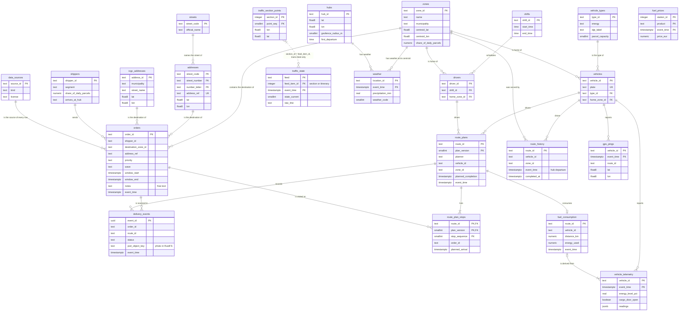

# Data model

Version 1 of the tables behind the platform. It covers every dataset of the
[phase 1 data inventory](phases/1-case.md#data-inventory) and is created by the versioned SQL
migrations in [`infra/postgres/migrations/`](../infra/postgres/migrations/).

## Layers

| Layer | Where | What it holds | Written by |
|---|---|---|---|
| Raw payloads | RustFS bucket `bronze` | Every batch file and API response exactly as it arrived, plus proof-of-delivery photos | Loaders, generator, simulator |
| `bronze` | TimescaleDB | The same records parsed into typed rows, with their metadata. Append-only, and no record is rejected for its values | Stream consumer, loaders, optimizer |
| `silver` | TimescaleDB | Cleaned, deduplicated and joined data: dimensions and facts | dbt |
| `gold` | TimescaleDB | The KPI and the marts the dashboards read | dbt |
| `ops` | TimescaleDB | Platform bookkeeping: data source registry, migrations, health checks | Platform |

This version defines `bronze` and `ops`. The `silver` and `gold` models are dbt models, so dbt
creates them; they are listed at the end of this document.

## The three mandatory metadata elements

ADR 0001, decision 20, requires three metadata elements on every table. This is how the tables
in `bronze` and `ops` implement them:

| Element | Implementation |
|---|---|
| `source`: origin system and license | A `source` column on every table, `NOT NULL`, with a foreign key to `ops.data_sources`, which records the provider, the kind of data (real, AI-generated, simulated, platform), the license and a URL. A writer cannot use a source that is not registered. The registry and the migration ledger are written by the migrations, so their own `source` is `platform/migrations` |
| `ingested_at` next to `event_time`: freshness and delay | `ingested_at` defaults to the time the row was written. Event tables also have `event_time`, the moment the event happened in the real world, so `ingested_at - event_time` is the pipeline delay. Reference tables and the ops ledgers describe things, not events, so they only have `ingested_at` ([ADR 0001 amendment](decisions/0001-architecture-baseline.md#amendments)) |
| `owner` with `schema_version` | A JSON table comment, for example `{"owner": "fleet", "schema_version": 2}`. The view `ops.table_metadata` parses it for every table and shows `NULL` for a comment it cannot read. The smoke test fails if a table in `bronze` or `ops` lacks any of the three |

The owner is a function of Llobregat Express that answers for the data: `operations` (hub,
zones, drivers, orders, routes), `fleet` (vehicles and their sensors) or `platform` (external
feeds and bookkeeping).

Rows that come from a file or an API response also keep `raw_object_key`, the key of that payload
in the RustFS `bronze` bucket, so each row can be traced back to the bytes it was parsed from.

```sql
-- Which tables exist, who owns them, and do they carry the metadata columns?
SELECT * FROM ops.table_metadata WHERE schema_name IN ('bronze', 'ops');
```

## Bronze tables

All tables below are in the `bronze` schema, except `data_sources` in `ops`. Relationships are
drawn as the data joins; the note under the diagram says which ones are enforced by foreign keys.



Foreign keys are enforced among the reference tables (`vehicles`, `drivers`, `zones`, `shifts`,
`vehicle_types`), between `route_plan_stops` and `route_plans`, and from every `source` column in
`bronze` and `ops` to `ops.data_sources` (drawn once, for `orders`). Event tables have no foreign
keys to reference data on purpose: a raw record must never be rejected because a reference table
was loaded late. Those joins, `orders.address_ref` to `addresses` or `icgc_addresses` among them, are checked by dbt
relationship tests in silver (issue #10).

`traffic_state.feed_item_id` means a street section for the `trams` feed and an itinerary for the
`itineraris` feed. Only `trams` rows join `traffic_section_points`, on `section_id`; the city
publishes no geometry table for itineraries.

### What each table holds

Reference data, loaded in batch:

| Table | Holds | Comes from |
|---|---|---|
| `hubs` | The Zona Franca cross-dock: location, size, daily timetable and the geofence radius that defines leaving the hub | Company profile, `company.json` (prompt 001). `geofence_radius_m` is a platform assumption, 400 m: the hub point is 284 m from the nearest drivable road (prompt 001 validation), so a smaller radius would end inside the yard |
| `zones` | The 14 service zones: centroid, share of parcels, stops per route, difficulty, preferred vehicle types | Company profile, `company.json` (prompt 001) |
| `shifts` | The morning and afternoon-evening driver shifts | Company profile, `company.json` (prompt 001) |
| `vehicle_types` | The six vehicle classes of the fleet: energy, DGT label, capacity, consumption, sensors | Company profile, `company.json` (prompt 001) |
| `vehicles` | One row per van: plate, type, home zone, registration year, odometer, battery health, whether it also runs the afternoon wave, maintenance note | AI-generated fleet register, `fleet.json` (prompt 002) |
| `drivers` | One row per driver: shift, contract, languages, the zones the driver knows, the vehicle types the driver is cleared for, a planning note. The relief pool has no shift. Names are fictional | AI-generated driver roster, `drivers.json` (prompt 003) |
| `shippers` | The 40 shippers: segment, share of the parcels, parcel mix, same-day share, business share and zones, how their parcels reach the hub | AI-generated demand model, `demand.json` (prompt 004) |
| `traffic_section_points` | One row per point of every street section of the `trams` traffic feed: section, position along it, description, longitude and latitude | Open Data BCN `transit-relacio-trams`, the long-format CSV, loaded once |
| `addresses` | Every postal address of Barcelona: street code, number and letter, district, neighbourhood, census section, and coordinates in ED50, ETRS89 and WGS84. `address_ref` is the value `orders.address_ref` points to | Open Data BCN `taula-direle`, CSV loaded with the generator (issue #3) |
| `streets` | The street register of Barcelona: code and official name of every street | Open Data BCN `carrerer`, CSV loaded with the generator |
| `icgc_addresses` | Every street address of L'Hospitalet, El Prat, Cornellà, Esplugues and Sant Boi de Llobregat, which `taula-direle` does not cover: street, number, postcode, ETRS89 coordinates as published and their WGS84 conversion. `address_id` is the value `orders.address_ref` points to | ICGC Adreces simplificat, CSV of all of Catalonia filtered to the five municipalities by the generator |

Events and measurements:

| Table | Holds | Comes from | Arrives |
|---|---|---|---|
| `orders` | One row per order: shipper, destination at a real address, priority, wave, time window and the recipient's free-text `notes` | Order generator: the demand model (prompt 004) at real addresses of Open Data BCN and ICGC ([generator](../services/generator/README.md)) | One Parquet file per service date in the RustFS `bronze` bucket, written with the rows |
| `delivery_events` | Every scan of the driver's handheld: loaded, arrived, delivered, failed, returned. `pod_object_key` points to the proof-of-delivery photo | Simulated handheld, topic `delivery.events` | Stream |
| `route_plans` | One row per plan of a route: version 0 is the baseline plan made before departure, later versions are re-plans by the optimizer | Optimizer | On departure and on every re-plan |
| `route_plan_stops` | The stops of each plan, in order, with planned arrival times | Optimizer | With its plan |
| `route_history` | Ninety days of completed routes: departure, completion, stops delivered and failed. The KPI's baseline | AI-generated route history | Nightly batch file |
| `gps_pings` | Position, speed and heading of every van | Simulated GPS along OSRM routes, topic `gps.pings` | Stream, every 5 s per van |
| `vehicle_telemetry` | Speed, odometer, ignition, battery or fuel level, energy counter and cargo door; type-specific sensors in `readings` (JSON) | Simulated telemetry, topic `vehicle.telemetry` | Stream, every 30 s per van |
| `fuel_consumption` | One row per route: distance, energy used, idle time and consumption per 100 km | Derived by the platform from `vehicle_telemetry` (source `derived/vehicle_telemetry`), see below | When a route ends |
| `traffic_state` | Traffic state per section (`trams`) and travel times per itinerary (`itineraris`), with the original `#`-delimited line; `feed_item_id` is the section or the itinerary | Open Data BCN, real | Every 5 minutes |
| `weather` | Current conditions at the hub and at every zone centroid | Open-Meteo, real | Hourly |
| `fuel_prices` | Price per station and product in the province of Barcelona: diesel and CNG for the fleet. Electricity has no open price feed and is costed at a documented fixed tariff (issue #9) | MINETUR, real | Polled hourly; MINETUR updates once a day |

`fuel_consumption` is the one bronze table the platform derives instead of receiving. Its
lineage: when a route ends, the platform takes the first and the last `vehicle_telemetry` reading
of that vehicle on that route; `distance_km` is the difference of `odometer_km`, `energy_used` the
difference of `energy_used_total` in its `energy_unit`, and `idle_minutes` the time with the
ignition on and the van standing. It stays in bronze, one row per route, so the cost side of the
KPI reads a small table instead of scanning the telemetry.

Platform tables in `ops`:

| Table | Holds |
|---|---|
| `data_sources` | The registry every `source` column points to: provider, kind, license, URL. Its own rows have `source` `platform/migrations` |
| `table_metadata` | View: owner, schema version and metadata columns of every table |
| `schema_migrations` | Every migration applied, with its checksum and when it ran |
| `service_health` | Health probes of every service, written by Dagster every 5 minutes |

### Keys and constraints

- **Idempotent keys.** Every event table has a natural key, so replaying a Kafka topic or
  reloading a file writes nothing twice (`INSERT ... ON CONFLICT DO NOTHING`): `(vehicle_id,
  event_time)` for pings and telemetry, the handheld's `event_id` for delivery events,
  `(feed, feed_item_id, event_time)` for traffic.
- **Bronze accepts every raw record.** Bronze keeps its primary and unique keys, the foreign keys
  above, and `NOT NULL` on key and metadata columns. It has no `CHECK` constraints: a ping outside
  Catalonia, an unknown status or a route that ends before it starts is stored as it arrived.
  Validation happens in silver, where dbt tests flag or filter such rows (issue #10), so a bad
  value is counted and visible instead of lost at the door. Version 1 of the tables had those
  checks in bronze; migration 007 removed them.
- **What silver tests.** Coordinates inside a bounding box of Catalonia, the area the road graph
  covers, which also catches swapped latitude and longitude; a failed delivery has a reason; only
  a delivered parcel has a proof-of-delivery photo; a time window ends after it starts; plan
  version 0 is the baseline plan; delivered plus failed stops never exceed planned stops;
  statuses, priorities, energy types, DGT labels and traffic states take their allowed values.
- **Write-once.** Pipelines insert bronze rows and never update or delete them. Reference loads
  insert only the rows whose key is new, so loading a file twice writes nothing the second time.
  The one exception is the order generator: regenerating a service date replaces that date's
  generated orders (`source = 'generator/orders'`) and its file in one transaction, so a date is
  never duplicated. A plan's stops
  have no `ON DELETE CASCADE`, so deleting a plan that has stops fails instead of taking them
  along.

## Storage lifecycle

The high-volume tables are TimescaleDB hypertables, partitioned by `event_time` into chunks:

| Hypertable | Chunk | Compressed after | Dropped after |
|---|---|---|---|
| `gps_pings` | 1 day | 1 day | never, until archiving exists |
| `vehicle_telemetry` | 1 day | 1 day | never, until archiving exists |
| `traffic_state` | 1 day | 1 day | never, until archiving exists |
| `fuel_prices` | 7 days | never | never, until archiving exists |

Compression moves a chunk to TimescaleDB's columnstore, segmented by vehicle or feed item, which
keeps queries fast and the disk small.

No chunk is dropped yet. For GPS pings and telemetry the hypertable is the only copy: the RustFS
`bronze` bucket holds batch files, API responses and photos, not stream messages, and Redpanda
keeps a topic for 24 hours. Retention policies come back with the archiving job (issue #20),
which exports a chunk to the RustFS `archive` bucket before it is dropped. Version 1 had 30-,
90- and 365-day retention policies; migration 007 removed them. What the KPI needs over long
periods also lives in smaller tables: `route_history`, `route_plans`, `delivery_events` and
`fuel_consumption`.

## Access

Grafana connects as `grafana_reader`, which can read `gold` and `ops` and nothing else. `bronze`
holds raw data and, in a real company, personal data (recipient and driver names, addresses), so
no dashboard can query it. The smoke test checks both sides: the role reads `ops` and is denied
on `bronze`.

- The grants live in two places on purpose. `infra/postgres/init/01-platform.sh` creates the
  role with its password and first grants when the volume is created; migration 006 applies the
  full set, so an existing volume ends up with the same access.
- `ALTER DEFAULT PRIVILEGES` covers tables created by `POSTGRES_USER`. dbt runs as that role, so
  every new `gold` model is readable by Grafana without another grant.
- The role keeps PostgreSQL's default `USAGE` on schema `public`, where the TimescaleDB functions
  live (`time_bucket` and others); the dashboards' queries need them. `public` holds no tables.

## Migrations

`infra/postgres/migrations/NNN_description.sql` are applied in order by the one-shot Compose
service `db-migrate` on every `docker compose up`, before Dagster and Grafana start. Each file
runs in one transaction and is recorded in `ops.schema_migrations` with its name and SHA-256
checksum. Because the service runs on every start, a new migration also reaches an existing
volume. The runner holds an advisory lock for the whole run, so `make migrate` during a
`docker compose up` waits its turn instead of failing.

```bash
make migrate                                   # apply pending migrations now
docker compose logs db-migrate                 # what the last start applied
```

To change the model, add a new file with the next number. Never edit an applied migration: the
runner compares names and checksums and stops if a file changed or two files share a number. A
table whose columns or constraints change gets its `schema_version` bumped in its comment in the
same migration.

| Migration | What it does |
|---|---|
| 001 | Data source registry and the `ops.table_metadata` view |
| 002 | Reference tables from the company profile, vehicles and drivers |
| 003 | Orders, delivery events, route plans and route history |
| 004 | GPS and telemetry hypertables, fuel consumption |
| 005 | Traffic, weather and fuel prices |
| 006 | Access for `grafana_reader` |
| 007 | Raw bronze without value checks or retention, `source` and `ingested_at` on the ops tables, hub geofence, fuel consumption derived from telemetry, `traffic_state.feed_item_id`, `addresses` |
| 008 | `traffic_section_points`, the long CSV format, replaces `traffic_sections` and its packed polyline |
| 009 | `shippers`, `streets` and `icgc_addresses`; the fields of the fleet register and the driver roster on `vehicles` and `drivers`; `shipper_id`, `wave` and `window_type` on `orders`; their data sources |
| 010 | `raw_object_key` on `vehicles`, `drivers` and `shippers`, the key of the Parquet file each is loaded from |

## Silver and gold (dbt, issue #10)

Planned models, built by dbt from the bronze tables above:

| Model | Grain | Built from |
|---|---|---|
| `silver.dim_hub`, `silver.dim_zone`, `silver.dim_shift`, `silver.dim_vehicle_type` | One row per hub, zone, shift, vehicle type | `hubs`, `zones`, `shifts`, `vehicle_types` (company profile) |
| `silver.dim_vehicle`, `silver.dim_driver` | One row per vehicle, driver | `vehicles`, `drivers` |
| `silver.dim_shipper` | One row per shipper | `shippers` |
| `silver.dim_address` | One row per postal address | `addresses`, `streets`, `icgc_addresses` |
| `silver.fct_route` | One row per route: departure from the hub geofence (`hubs.geofence_radius_m`), completion, planned duration | `gps_pings`, `delivery_events`, `route_plans`, `route_history`, `hubs` |
| `silver.fct_delivery` | One row per order: final status, time in window, proof-of-delivery photo | `orders`, `delivery_events` |
| `silver.fct_traffic`, `silver.fct_weather` | One row per section or location and time | `traffic_state`, `traffic_section_points`, `weather` |
| `gold.kpi_route_duration` | Average delivery time per route by day, zone, hour of departure, vehicle type and weather | `fct_route` and dimensions |
| `gold.kpi_delay_and_on_time` | Average delay against plan and on-time share | `fct_route`, `fct_delivery` |
| `gold.fct_deliveries` | One row per order for the dashboards, with the key of the proof-of-delivery photo (issue #25) | `fct_delivery` and dimensions |

The silver tests carry the value rules listed under [Keys and constraints](#keys-and-constraints),
so bronze can stay raw.
