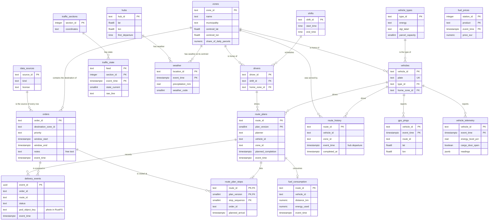

# Data model

Version 1 of the tables behind the platform. It covers every dataset of the
[phase 1 data inventory](phases/1-case.md#data-inventory) and is created by the versioned SQL
migrations in [`infra/postgres/migrations/`](../infra/postgres/migrations/).

## Layers

| Layer | Where | What it holds | Written by |
|---|---|---|---|
| Raw payloads | RustFS bucket `bronze` | Every batch file and API response exactly as it arrived, plus proof-of-delivery photos | Loaders, generator, simulator |
| `bronze` | TimescaleDB | The same records parsed into typed rows, with their metadata. Append-only | Stream consumer, loaders, optimizer |
| `silver` | TimescaleDB | Cleaned, deduplicated and joined data: dimensions and facts | dbt |
| `gold` | TimescaleDB | The KPI and the marts the dashboards read | dbt |
| `ops` | TimescaleDB | Platform bookkeeping: data source registry, migrations, health checks | Platform |

This version defines `bronze` and `ops`. The `silver` and `gold` models are dbt models, so dbt
creates them; they are listed at the end of this document.

## The three mandatory metadata elements

ADR 0001, decision 20, requires three metadata elements on every table. This is how the tables
implement them:

| Element | Implementation |
|---|---|
| `source`: origin system and license | A `source` column on every table, `NOT NULL`, with a foreign key to `ops.data_sources`, which records the provider, the kind of data (real, AI-generated, simulated, platform), the license and a URL. A writer cannot use a source that is not registered |
| `ingested_at` next to `event_time`: freshness and delay | `ingested_at` defaults to the time the row was written. Event tables also have `event_time`, the moment the event happened in the real world, so `ingested_at - event_time` is the pipeline delay. Reference tables describe things, not events, so they only have `ingested_at` |
| `owner` with `schema_version` | A JSON table comment, for example `{"owner": "fleet", "schema_version": 1}`. The view `ops.table_metadata` parses it for every table |

The owner is a function of Llobregat Express that answers for the data: `operations` (hub,
zones, drivers, orders, routes), `fleet` (vehicles and their sensors) or `platform` (external
feeds and bookkeeping).

Rows that come from a file or an API response also keep `raw_object_key`, the key of that payload
in the RustFS `bronze` bucket, so each row can be traced back to the bytes it was parsed from.

```sql
-- Which tables exist, who owns them, and do they carry the metadata columns?
SELECT * FROM ops.table_metadata WHERE schema_name = 'bronze';
```

## Bronze tables

All tables below are in the `bronze` schema, except `data_sources` in `ops`. Relationships are
drawn as the data joins; the note under the diagram says which ones are enforced by foreign keys.



Foreign keys are enforced among the reference tables (`vehicles`, `drivers`, `zones`, `shifts`,
`vehicle_types`), between `route_plan_stops` and `route_plans`, and from every `source` column to
`ops.data_sources` (drawn once, for `orders`). Event tables have no foreign keys to reference
data on purpose: a raw record must never be rejected because a reference table was loaded late.
Those joins are checked by dbt relationship tests in silver (issue #10).

### What each table holds

Reference data, loaded in batch:

| Table | Holds | Comes from |
|---|---|---|
| `hubs` | The Zona Franca cross-dock: location, size and daily timetable | Company profile, `company.json` (prompt 001) |
| `zones` | The 14 service zones: centroid, share of parcels, stops per route, difficulty, preferred vehicle types | Company profile, `company.json` (prompt 001) |
| `shifts` | The morning and afternoon-evening driver shifts | Company profile, `company.json` (prompt 001) |
| `vehicle_types` | The six vehicle classes of the fleet: energy, DGT label, capacity, consumption, sensors | Company profile, `company.json` (prompt 001) |
| `vehicles` | One row per van, with plate, type and home zone | AI-generated fleet, expanded from the vehicle types |
| `drivers` | One row per driver, with shift and home zone. Names are fictional | AI-generated drivers, sized by the shifts |
| `traffic_sections` | Description and polyline of every street section of the traffic feeds | Open Data BCN `transit-relacio-trams`, CSV loaded once |

Events and measurements:

| Table | Holds | Comes from | Arrives |
|---|---|---|---|
| `orders` | One row per order: shipper, destination at a real address, priority, time window and the recipient's free-text `notes` | AI-generated order batch at Open Data BCN addresses | Daily batch file |
| `delivery_events` | Every scan of the driver's handheld: loaded, arrived, delivered, failed, returned. `pod_object_key` points to the proof-of-delivery photo | Simulated handheld, topic `delivery.events` | Stream |
| `route_plans` | One row per plan of a route: version 0 is the baseline plan made before departure, later versions are re-plans by the optimizer | Optimizer | On departure and on every re-plan |
| `route_plan_stops` | The stops of each plan, in order, with planned arrival times | Optimizer | With its plan |
| `route_history` | Ninety days of completed routes: departure, completion, stops delivered and failed. The KPI's baseline | AI-generated route history | Nightly batch file |
| `gps_pings` | Position, speed and heading of every van | Simulated GPS along OSRM routes, topic `gps.pings` | Stream, every 5 s per van |
| `vehicle_telemetry` | Speed, odometer, ignition, battery or fuel level, energy counter and cargo door; type-specific sensors in `readings` (JSON) | Simulated telemetry, topic `vehicle.telemetry` | Stream, every 30 s per van |
| `fuel_consumption` | One trip report per route: distance, energy used and consumption per 100 km | Simulated telematics unit, aggregating the telemetry counters | When a route ends |
| `traffic_state` | Traffic state per section (`trams`) and travel times per itinerary (`itineraris`), with the original `#`-delimited line | Open Data BCN, real | Every 5 minutes |
| `weather` | Current conditions at the hub and at every zone centroid | Open-Meteo, real | Hourly |
| `fuel_prices` | Price per station and product in the province of Barcelona | MINETUR, real | Hourly |

Platform tables in `ops`:

| Table | Holds |
|---|---|
| `data_sources` | The registry every `source` column points to: provider, kind, license, URL |
| `table_metadata` | View: owner, schema version and metadata columns of every table |
| `schema_migrations` | Every migration applied, with its checksum and when it ran |
| `service_health` | Health probes of every service, written by Dagster every 5 minutes |

### Keys and constraints

- **Idempotent keys.** Every event table has a natural key, so replaying a Kafka topic or
  reloading a file writes nothing twice (`INSERT ... ON CONFLICT DO NOTHING`): `(vehicle_id,
  event_time)` for pings and telemetry, the handheld's `event_id` for delivery events,
  `(feed, section_id, event_time)` for traffic.
- **Coordinates inside Catalonia.** Every latitude and longitude is checked against a bounding
  box of Catalonia, the area the road graph covers. It also rejects swapped coordinates.
- **Business rules that cannot be broken.** A failed delivery has a reason; only a delivered
  parcel has a proof-of-delivery photo; a time window ends after it starts; plan version 0 is
  always the baseline plan; delivered plus failed stops never exceed planned stops.
- **Closed vocabularies.** Statuses, priorities, energy types, DGT labels and traffic states are
  checked against their allowed values.

## Storage lifecycle

The high-volume tables are TimescaleDB hypertables, partitioned by `event_time` into chunks:

| Hypertable | Chunk | Compressed after | Dropped after |
|---|---|---|---|
| `gps_pings` | 1 day | 1 day | 30 days |
| `vehicle_telemetry` | 1 day | 1 day | 30 days |
| `traffic_state` | 1 day | 1 day | 90 days |
| `fuel_prices` | 7 days | never | 365 days |

Compression moves a chunk to TimescaleDB's columnstore, segmented by vehicle or section, which
keeps queries fast and the disk small. Dropped chunks are not lost: the raw payloads stay in
RustFS, where the archiving policies (issue #20) move them to the `archive` bucket. What the KPI
needs for longer than 30 days lives in smaller tables that are never dropped: `route_history`,
`route_plans`, `delivery_events` and `fuel_consumption`.

## Access

Grafana connects as `grafana_reader`, which can read `gold` and `ops` and nothing else. `bronze`
holds raw data and, in a real company, personal data (recipient and driver names, addresses), so
no dashboard can query it. The smoke test checks both sides: the role reads `ops` and is denied
on `bronze`.

## Migrations

`infra/postgres/migrations/NNN_description.sql` are applied in order by the one-shot Compose
service `db-migrate` on every `docker compose up`, before Dagster and Grafana start. Each file
runs in one transaction and is recorded in `ops.schema_migrations` with its SHA-256 checksum.
Because the service runs on every start, a new migration also reaches an existing volume.

```bash
make migrate                                   # apply pending migrations now
docker compose logs db-migrate                 # what the last start applied
```

To change the model, add a new file with the next number. Never edit an applied migration: the
runner compares checksums and stops if a file changed. A table whose columns change gets its
`schema_version` bumped in its comment in the same migration.

## Silver and gold (dbt, issue #10)

Planned models, built by dbt from the bronze tables above:

| Model | Grain | Built from |
|---|---|---|
| `silver.dim_zone`, `silver.dim_vehicle`, `silver.dim_driver`, `silver.dim_shift` | One row per zone, vehicle, driver, shift | Reference tables |
| `silver.fct_route` | One row per route: departure from the hub geofence, completion, planned duration | `gps_pings`, `delivery_events`, `route_plans`, `route_history` |
| `silver.fct_delivery` | One row per order: final status, time in window, proof-of-delivery photo | `orders`, `delivery_events` |
| `silver.fct_traffic`, `silver.fct_weather` | One row per section or location and time | `traffic_state`, `traffic_sections`, `weather` |
| `gold.kpi_route_duration` | Average delivery time per route by day, zone, hour of departure, vehicle type and weather | `fct_route` and dimensions |
| `gold.kpi_delay_and_on_time` | Average delay against plan and on-time share | `fct_route`, `fct_delivery` |
