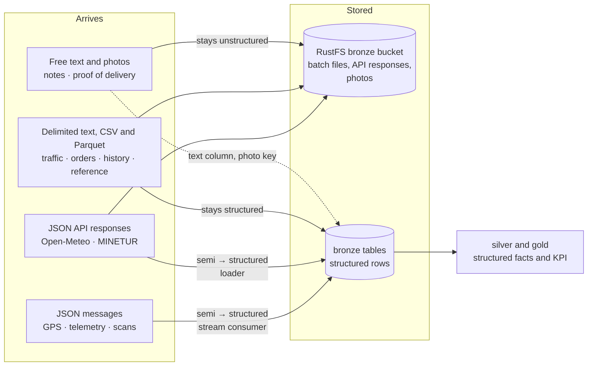

# Phase 2 · Data classification

> Classify the data of the case as **structured**, **semi-structured** or **unstructured**, and
> justify each classification.

Every dataset of the [phase 1 inventory](1-case.md#data-inventory) is classified here by the
format it actually has in this pipeline, not by what the data is about. The same fact, "van V07
is at this corner", can be a line of delimited text, a JSON message or a row in a table, and each
of those is a different category. That is why the classification is given twice: as the data
arrives, and as it is stored for analysis.

## Terms used in this document

| Term | Meaning |
|---|---|
| Bronze, silver, gold | The three layers of the platform's database. Bronze holds every record as it arrived, parsed into rows but not cleaned; silver holds cleaned and joined data; gold holds the KPI and what the dashboards read. See the [data model](../data-model.md) |
| Hypertable | A TimescaleDB table split by time into chunks, used for data that grows all day: GPS pings, telemetry, traffic |
| Redpanda, topic | Redpanda is the platform's message broker. It speaks the Kafka protocol, so any Kafka client can write to it or read from it. A topic is a named, ordered log of messages, such as `gps.pings` |
| RustFS, bucket | The platform's S3-compatible object storage. The `bronze` bucket keeps batch files, API responses and photos as they arrived |
| Parquet | A columnar file format for tables. The file stores its column names and types once, in its footer, like a typed CSV header |
| DIKW | Data, information, knowledge, wisdom: the hierarchy that phase 3 applies to the GPS ping |
| PBF | Protocolbuffer Binary Format, the compressed binary format of OpenStreetMap extracts |
| MINETUR | The Spanish ministry that publishes the price of every fuel at every service station through an open REST API (today part of MITECO) |
| WMO code | The World Meteorological Organization's weather code, a number from 0 to 99 (3 is overcast, 61 is light rain) |
| SCT, DATEX II | The Servei Català de Trànsit, Catalonia's traffic authority, and DATEX II, the European XML standard it uses to publish road incidents |

## How to tell

Three questions decide the category. They are applied in order to the bytes as they arrive.

| Question | Structured | Semi-structured | Unstructured |
|---|---|---|---|
| Where is the schema? | Outside the data, fixed in advance: a table definition or a documented column order | Inside the data: every value carries its key or tag | Nowhere: there are no fields, only content |
| Do all records have the same fields? | Yes, same fields in the same order, one value each | Not necessarily: fields can be optional, repeated, nested or depend on the record type | Not applicable |
| How do you get one value out? | Read the column | Parse the document and walk to the key or tag | Interpret the content: a person, text analysis or image recognition |

Four rules settle the edge cases:

1. **The container does not decide.** Free text stored in a `text` column is still unstructured
   content, and a JSON document stored in a `jsonb` column is still semi-structured. The category
   belongs to the value, not to the database that holds it.
2. **A published schema does not make a document structured.** `company.json` is checked against
   a JSON Schema, but it stays a hierarchical, self-describing document with nested and optional
   parts. Having a schema makes it *validated*, not *flat*.
3. **Text is not the same as unstructured.** A `#`-delimited text file with a fixed column order
   is structured: it is a table written as text. What makes data unstructured is the absence of
   fields, not the use of characters.
4. **One category per dataset and stage.** A dataset takes the category of its overall shape.
   When one part of it differs, such as a free-text field in a table, that part is named in the
   justification and, where it matters, classified on its own.

## Summary

| # | Dataset | Arrives as | On arrival | Stored for analysis as | At rest |
|---|---|---|---|---|---|
| 1 | Vehicle GPS location | JSON message on topic `gps.pings` | Semi-structured | Rows in the `bronze.gps_pings` hypertable | Structured |
| 2 | Orders | Parquet files in the `bronze` bucket, one row per order: micro-batches through the day, next-day orders nightly | Structured | Rows in `bronze.orders` | Structured |
| 2 | Order status changes | JSON message on topic `delivery.events` | Semi-structured | Rows in `bronze.delivery_events` | Structured |
| 3 | Road traffic (Open Data BCN) | `#`-delimited text file, no header, every 5 min | Structured | Rows in the `bronze.traffic_state` hypertable, original line kept | Structured |
| 4 | Route history | Nightly Parquet file in the `bronze` bucket, one row per route | Structured | Rows in `bronze.route_history` | Structured |
| 5 | Fuel consumption | Computed by the platform from the vehicle status rows when a route ends | Structured | One row per route in `bronze.fuel_consumption` | Structured |
| 5 | Fuel prices (MINETUR) | JSON document from a REST API | Semi-structured | Rows in the `bronze.fuel_prices` hypertable | Structured |
| 6 | Vehicle status (sensors) | JSON message on topic `vehicle.telemetry`, keys vary by vehicle type | Semi-structured | Rows in `bronze.vehicle_telemetry`, type-specific sensors in a `jsonb` column | Structured |
| 7 | Weather (Open-Meteo) | JSON document from a REST API | Semi-structured | Rows in `bronze.weather` | Structured |
| + | Delivery notes | Free text inside each order | Unstructured | `notes` column of `bronze.orders` | Unstructured |
| + | Proof-of-delivery photos | JPEG image per delivered parcel | Unstructured | Object in the RustFS `bronze` bucket, key in `bronze.delivery_events` | Unstructured |
| R | Company profile | One nested JSON document, `company.json` | Semi-structured | `bronze.hubs`, `zones`, `shifts`, `vehicle_types` | Structured |
| R | Fleet register and driver roster | Parquet files in the `bronze` bucket, one row per vehicle or driver | Structured | `bronze.vehicles`, `bronze.drivers` | Structured |
| R | Demand model | JSON document of the order generator's parameters | Semi-structured | Shippers in `bronze.shippers`; the order generator reads the other parameters | Structured |
| R | Postal addresses (Open Data BCN, ICGC) | CSV files with a header row | Structured | Rows in `bronze.addresses`, `bronze.streets`, `bronze.icgc_addresses` | Structured |
| R | Traffic sections (Open Data BCN) | Long-format CSV with a header row, one row per point of a section | Structured | Rows in `bronze.traffic_section_points` | Structured |
| R | Road network (OpenStreetMap) | PBF file of nodes, ways and relations with free-form tags | Semi-structured | The PBF file, compiled by OSRM into its own routing files | Semi-structured |

`#` is the row of the phase 1 inventory; `+` marks the two unstructured datasets added to it and
`R` the reference data. The AI-generated fallbacks of the external feeds (issue #9) are generated
in the same format as the real feed they replace, so each has the same category as that feed.

## The seven data types of the case

### 1 · Vehicle GPS location

**On the topic: semi-structured. In the hypertable: structured.**

The GPS simulator publishes one JSON message per van every five seconds to the Redpanda topic
`gps.pings`:

```json
{"vehicle_id": "V07", "route_id": "R-20261001-Z02-1", "event_time": "2026-10-01T08:14:05Z",
 "lat": 41.3921, "lon": 2.1614, "speed_kmh": 18.4, "heading_deg": 92, "accuracy_m": 4.0}
```

Each value travels with its key, the key order does not matter, and `route_id` is simply absent
while the van waits at the hub. Nothing outside the message says what it contains: that is
semi-structured. The broker itself sees only bytes, so any producer could add a field tomorrow.

The stream consumer parses each message and writes it into `bronze.gps_pings`, a table with a
fixed column for every field and a type for every column. From that moment the ping is
structured: the same columns in every row, queryable by column name, partitioned by time. The GPS
ping is also the raw element of the DIKW hierarchy in phase 3; this is the step where it becomes
a row that can be aggregated.

### 2 · Orders (origin, destination, priority)

**Orders: structured. Status changes: semi-structured on the topic, structured in the table.**

The order generator writes Parquet files to the RustFS `bronze` bucket: micro-batches through the
day and a nightly batch of next-day orders. Every file has one row per order and the same columns:
order id, shipper and origin, destination address and coordinates at a real Open Data BCN
address, zone, priority, service level, parcel size and time window. A Parquet file stores its
column names and types once, in its footer, and no value carries its own key, so it is a table:
structured, and it loads one-to-one into `bronze.orders`.

One field of the row differs: `notes`, the recipient's free text, classified on its own below.

As the parcels move, the driver's handheld emits status events (`loaded`, `arrived`,
`delivered`, `failed`, `returned`) as JSON messages on the topic `delivery.events`, which is
created together with the simulator that produces them (issue #7). Like GPS pings, they are
semi-structured in transit: a failed attempt carries a `failure_reason` key and a delivery carries
a `pod_object_key`, so the fields depend on the status. The consumer lands them in
`bronze.delivery_events`, where those fields are nullable columns. At rest they are structured.

### 3 · Road traffic data (external API)

**Structured, as it arrives and as it is stored.**

The Open Data BCN traffic feeds are plain text files, refreshed every five minutes, with one line
per street section and the fields separated by `#`. This is the real `trams` feed on
28 September 2026:

```text
1#20260928220554#6#6
5#20260928220554#1#1
```

The fields are section id, timestamp, current state and state forecast for 15 minutes, where the
state goes from 0 (no data) to 6 (closed). The `itineraris` feed has eight fields per line
(`3#1#20260928221054#306#304#1#1#1`: itinerary id, data available, timestamp, current and forecast
travel time in seconds, and three coded indicators).

The file has no header and no keys, so it is even less self-describing than a CSV. It is still
structured: every line has the same fields in the same position, and the schema is fixed and
published by the city. The loader splits each line into typed columns of
`bronze.traffic_state`. It also keeps the original line in `raw_line`, so a field that is not
parsed yet is never lost.

Open Data BCN covers Barcelona city only. For the ring roads and the Llobregat bridges a second
source is planned: the SCT incidents feed in DATEX II on the DGT National Access Point
(issue #9). When it arrives it will be semi-structured: nested XML elements, and a
`situationRecord` whose `xsi:type` (`MaintenanceWorks`, `Accident`, ...) decides which child
elements follow.

### 4 · Route history

**Structured.**

The route history is generated as a nightly Parquet file in the `bronze` bucket, with one row per
completed route over the last ninety days: route, date, wave, zone, vehicle, driver, departure
from the hub, time of the last delivered or failed stop, planned duration, stops delivered and
failed, distance. Every row has the same columns, so the file is structured and loads directly
into `bronze.route_history`. It is batch data by nature: it describes the past and arrives once a
night, which is why the assignment hints at batch processing for it.

The optimizer's live plans (`bronze.route_plans` and `bronze.route_plan_stops`) are the same kind
of data for today's routes. The optimizer writes them as rows directly, so they are structured
from the moment they exist.

### 5 · Fuel consumption

**Consumption: structured. Fuel prices: semi-structured on arrival, structured at rest.**

Fuel consumption is not received from outside; the platform derives it. When a route ends, it
takes that van's vehicle status rows for the route (dataset 6, already structured in
`bronze.vehicle_telemetry`) and computes the distance from the odometer and the energy used from
the energy counter, in kWh, litres or kilograms depending on the vehicle. The result is one row
per route in `bronze.fuel_consumption`, with the same columns every time: structured from the
moment it exists. Its semi-structured origin is the telemetry message, classified under
dataset 6.

Fuel prices come from the MINETUR REST API as one JSON document for the province of Barcelona,
800 stations on 28 September 2026. The real response, shortened to one station:

```json
{"Fecha": "28/09/2026 17:05:53", "ResultadoConsulta": "OK",
 "ListaEESSPrecio": [{"IDEESS": "14790", "Rótulo": "HAM", "Municipio": "Abrera",
   "Latitud": "41,514583", "Longitud (WGS84)": "1,897944",
   "Precio Gas Natural Comprimido": "1,854", "Precio Gasoleo A": "", "...": "..."}]}
```

It is semi-structured: a header object wrapping an array of station objects, every value tagged
with its key. It also needs more than parsing to become usable data: prices and coordinates are
strings with decimal commas, and a product the station does not sell is an empty string rather
than a missing key. The loader converts the values, turns the 23 price keys into one row per
station and product, and lands them in `bronze.fuel_prices`, which is structured. MINETUR prices
diesel and natural gas but not electricity, which most of the fleet uses; electricity is costed
at a documented fixed tariff, a constant rather than a dataset (issue #9).

### 6 · Vehicle status (sensor data)

**On the topic: semi-structured. In the table: structured.**

Every thirty seconds each van publishes its sensor readings to `vehicle.telemetry`. The company
profile gives each vehicle type a different sensor list, so the messages genuinely differ:

```json
{"vehicle_id": "V03", "event_time": "2026-10-01T08:14:30Z", "energy_level_pct": 64.5,
 "energy_unit": "kWh", "cargo_door_open": true, "charging": false,
 "tyre_pressure_bar": [4.8, 4.8, 5.1, 5.0]}
{"vehicle_id": "V29", "event_time": "2026-10-01T08:14:30Z", "energy_level_pct": 71.0,
 "energy_unit": "l", "cargo_door_open": false, "adblue_level_pct": 58, "engine_rpm": 820}
```

The electric van reports its battery and charging state; the diesel van reports AdBlue and
engine speed. Same topic, same kind of message, different keys: this is the clearest
semi-structured dataset of the case.

In `bronze.vehicle_telemetry` the readings every vehicle has (speed, odometer, ignition, energy
level and counter, cargo door) become typed columns, so the table is structured. The
type-specific readings go into one `readings` column of type `jsonb`, as they arrived. By rule 1
the values in that column are still semi-structured; they stay that way on purpose, because
forcing every optional sensor into its own column would leave most of them empty for most vans.

### 7 · Weather conditions

**On arrival: semi-structured. At rest: structured.**

Open-Meteo answers each hourly request with a JSON document. The real response for the hub,
shortened:

```json
{"latitude": 41.3125, "longitude": 2.125, "timezone": "GMT", "elevation": 14.0,
 "current_units": {"time": "iso8601", "temperature_2m": "°C", "precipitation": "mm",
                   "weather_code": "wmo code"},
 "current": {"time": "2026-09-28T20:30", "interval": 900, "temperature_2m": 25.3,
             "precipitation": 0.00, "weather_code": 3}}
```

The document is nested, and the units live in a separate object from the values, keyed by the
same names. The set of keys is whatever the request asked for. The loader flattens it into one
row per location and time in `bronze.weather`, with the units fixed by the column names
(`temperature_c`, `precipitation_mm`), so the weather is structured at rest. The weather code
stays a number; its meaning (3 is overcast) comes from the WMO code table, a reference joined in
silver.

## Unstructured data

The seven data types of the case are all structured or semi-structured. A real parcel carrier
also handles unstructured data every day, so two datasets extend the list. They replace nothing.

### Delivery notes

**Unstructured.**

Recipients write instructions when they place an order: *"leave it with the neighbour at 3B"*,
*"the bell does not work, call when you arrive"*, *"office closes at 14:00, use the loading door
on Carrer de Pujades"*. They arrive as free text in the `notes` field of each order and are kept
in the `notes` column of `bronze.orders`.

The column is structured; its content is not. There are no fields inside a note, the same
instruction can be written in many ways, and in Barcelona in more than one language, and a
program cannot answer "does this recipient authorise a neighbour?" without interpreting the
language. That makes the notes unstructured, and they stay unstructured along the whole
lifecycle. The only way to get structured facts out of them would be to extract them, for
example by tagging notes that mention a neighbour, a concierge or a time limit. That extraction is
exactly the step from data to information of phase 3.

### Proof-of-delivery photos

**Unstructured.**

When a parcel is delivered, the handheld takes a photo of it at the door. The image is stored as
a JPEG object in the RustFS `bronze` bucket, under `pod/`, and the `delivered` event records the
object's key in `pod_object_key`.

The pixels have no fields at all: whether the photo shows a parcel in front of the right door can
only be answered by a person or by image recognition. The platform never tries to query them. It
reaches them through structured metadata instead: the row in `bronze.delivery_events` (which
order, when, where) and the object's own metadata in storage (size, content type, time written).
The planned gold model `gold.fct_deliveries` carries the photo's key next to each delivery
(issue #25), so a dashboard can link to the image without reading it. This split, unstructured
content addressed by structured references, is how the platform handles all binary data.

## Reference data

### Company profile

**On arrival: semi-structured. At rest: structured.**

`company.json` is one JSON document with nested objects (`hub.timetable`, `zones[].centroid`,
`fleet.vehicle_types[].consumption`) and arrays of different lengths (`districts` has 1 value in
Eixample and 13 in L'Hospitalet). A JSON Schema validates it, but by rule 2 it stays
hierarchical: semi-structured.

It is loaded into `bronze.hubs`, `zones`, `shifts` and `vehicle_types`, which have fixed, typed
columns: structured. Some of those columns hold lists of one declared type, `text[]` arrays with
no keys or nesting (`zones.districts`, `zones.preferred_vehicle_type_ids`,
`vehicle_types.telemetry_sensors`). The column type fixes their schema outside the data, so they
stay within the structured category, and silver turns them into one row per element when it
needs to join on them. One loaded field is prose: `zones.difficulty_factors` holds sentences, and
by rule 1 its content is unstructured text inside a structured table, as the notes of an order
are. The profile's other prose (`business_model`, `operational_risks`) is not loaded into tables.

### Fleet register and driver roster

**Structured.**

Prompts 002 and 003 (issue #3) each produce a flat list with one record per vehicle or driver.
The loader writes them to the `bronze` bucket as Parquet files with fixed columns and loads them
directly into `bronze.vehicles` and `bronze.drivers`. Three roster fields are lists (languages,
zones the driver knows, vehicle types the driver is cleared for); like the zone lists of the
company profile they are `text[]` columns of one declared type, so the tables stay structured.

### Demand model

**Semi-structured.**

Prompt 004 (issue #3) produces the parameters the order generator draws from: the shippers, the
hourly registration curve, the weekday multipliers, the consumer window choice, parcels per stop
and business opening hours. It is one JSON document with objects keyed by hour, weekday and
recipient type, and a list of assumptions in plain words, so it is semi-structured. The shipper
list is flat enough to load as a table with fixed columns, `bronze.shippers`: structured. The
other parameters stay in the document and reach the database only through the orders they shape.

### Postal addresses, Open Data BCN and ICGC

**Structured.**

Open Data BCN `taula-direle` is a CSV with a header row and one address per row: street code,
number and letter, district, neighbourhood, census section and postal district. Its coordinates
come in three reference systems (ED50, ETRS89 and WGS84), each in its own pair of columns. It
loads one-to-one into `bronze.addresses`, and each order keeps the key of its destination in
`address_ref`. It identifies a street by its code only; the city's street register, `carrerer`,
another CSV with a header row, gives the names and loads into `bronze.streets`.

The five neighbouring municipalities are not in `taula-direle`. Their addresses come from the ICGC
simplified address register of Catalonia: a zip of semicolon-delimited CSV files with header rows,
one row per street number, with coordinates in ETRS89 UTM zone 31N only. The loader keeps the five
municipalities and adds WGS84 coordinates converted from the published ones; the rows land in
`bronze.icgc_addresses`. All three files are structured.

### Traffic sections, Open Data BCN `transit-relacio-trams`

**Structured.**

The city publishes the geometry of the traffic sections in two layouts. The first packs a whole
polyline into one field, with between 2 and 38 points depending on the section: a variable-length
list inside a value. The second, `transit_relacio_trams_format_long.csv`, has one row per point
with five columns: section, position along the section, description, longitude and latitude. The
platform loads the long format into `bronze.traffic_section_points`, so every value has its own
column and the dataset is structured as it arrives.

### Road network, OpenStreetMap

**Semi-structured.**

The Catalonia extract is a PBF file of nodes, ways and relations, each carrying free-form
`key=value` tags (`highway=residential`, `maxspeed=30`, `oneway=yes`). Any tag can appear on any
element, and two ways of the same road type can carry different tags: the schema lives inside
the data, which makes it semi-structured. OSRM compiles the file into routing files in its own
binary format. The platform never reads those files; it asks OSRM for routes and distance
matrices instead, so the dataset it keeps is the PBF file, semi-structured.

## How the category changes along the lifecycle



- **Ingestion is where most data changes category.** Stream messages and API responses are
  semi-structured in transit and become structured rows when the consumer or the loader parses
  them. Parsing does not judge the values: bronze stores every row, and the checks on values run
  in silver.
- **Files and API responses are also kept as they arrived.** Batch files and API responses are
  stored in the RustFS `bronze` bucket, so their original category survives next to the
  structured rows. Stream messages are not stored there: the parsed row is their only copy, and
  a topic keeps a message for 24 hours.
- **Some semi-structure is kept on purpose.** Type-specific sensor readings stay as `jsonb`,
  because their shape differs by vehicle type.
- **Unstructured data does not change category.** Notes and photos stay unstructured. The
  platform attaches structured references to them (the order row, the object key) and, where it
  needs facts from them, extracts those facts as new structured data.
- **Silver and gold are fully structured.** The KPI, *Average Delivery Time per Route*, is
  computed only from structured rows and reported by day, zone, hour of departure, vehicle type
  and weather.
