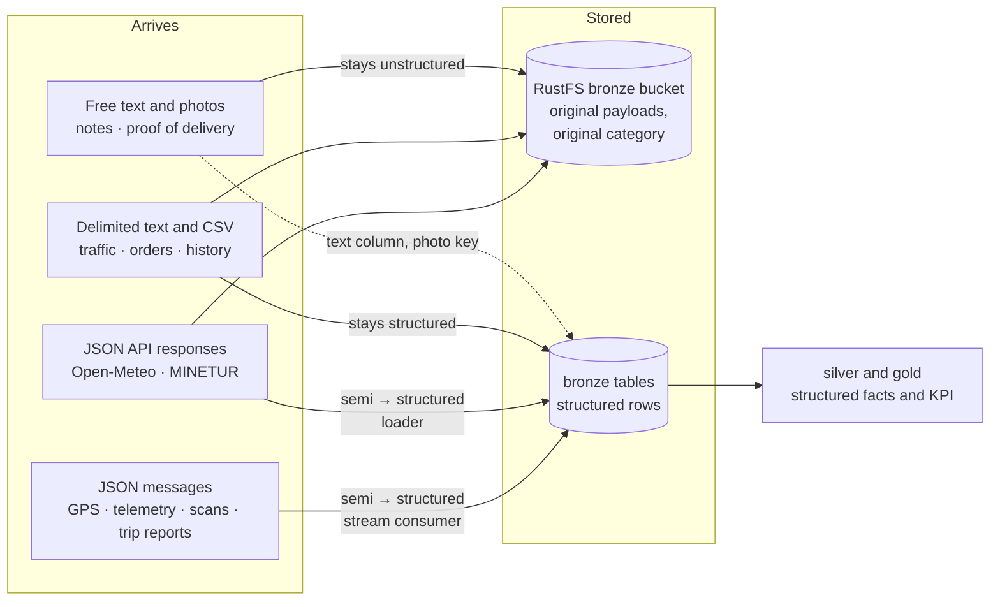

# Phase 2 · Data classification

> Classify the data of the case as **structured**, **semi-structured** or **unstructured**, and
> justify each classification.

Every dataset of the [phase 1 inventory](1-case.md#data-inventory) is classified here by the
format it actually has in this pipeline, not by what the data is about. The same fact, "van V07
is at this corner", can be a line of delimited text, a JSON message or a row in a table, and each
of those is a different category. That is why the classification is given twice: as the data
arrives, and as it is stored for analysis.

## How to tell

Three questions decide the category. They are applied in order to the bytes as they arrive.

| Question | Structured | Semi-structured | Unstructured |
|---|---|---|---|
| Where is the schema? | Outside the data, fixed in advance: a table definition or a documented column order | Inside the data: every value carries its key or tag | Nowhere: there are no fields, only content |
| Do all records have the same fields? | Yes, same fields in the same order, one value each | Not necessarily: fields can be optional, repeated, nested or depend on the record type | Not applicable |
| How do you get one value out? | Read the column | Parse the document and walk to the key or tag | Interpret the content: a person, text analysis or image recognition |

Three rules settle the edge cases:

1. **The container does not decide.** Free text stored in a `text` column is still unstructured
   content, and a JSON document stored in a `jsonb` column is still semi-structured. The category
   belongs to the value, not to the database that holds it.
2. **A published schema does not make a document structured.** `company.json` is checked against
   a JSON Schema, and DATEX II has an XML schema, but both stay hierarchical, self-describing
   documents with nested and optional parts. Having a schema makes them *validated*, not *flat*.
3. **Text is not the same as unstructured.** A `#`-delimited text file with a fixed column order
   is structured: it is a table written as text. What makes data unstructured is the absence of
   fields, not the use of characters.

## Summary

| # | Dataset | Arrives as | On arrival | Stored for analysis as | At rest |
|---|---|---|---|---|---|
| 1 | Vehicle GPS location | JSON message on topic `gps.pings` | Semi-structured | Rows in the `bronze.gps_pings` hypertable | Structured |
| 2 | Orders | Daily batch file with one row per order | Structured | Rows in `bronze.orders` | Structured |
| 2 | Order status changes | JSON message on topic `delivery.events` | Semi-structured | Rows in `bronze.delivery_events` | Structured |
| 3 | Road traffic (Open Data BCN) | `#`-delimited text file, no header, every 5 min | Structured | Rows in the `bronze.traffic_state` hypertable, original line kept | Structured |
| 4 | Route history | Nightly batch file with one row per route | Structured | Rows in `bronze.route_history` | Structured |
| 5 | Fuel consumption | JSON trip report at the end of each route | Semi-structured | One row per route in `bronze.fuel_consumption` | Structured |
| 5 | Fuel prices (MINETUR) | JSON document from a REST API | Semi-structured | Rows in the `bronze.fuel_prices` hypertable | Structured |
| 6 | Vehicle status (sensors) | JSON message on topic `vehicle.telemetry`, keys vary by vehicle type | Semi-structured | Rows in `bronze.vehicle_telemetry`, type-specific sensors in a `jsonb` column | Structured, with a semi-structured column |
| 7 | Weather (Open-Meteo) | JSON document from a REST API | Semi-structured | Rows in `bronze.weather` | Structured |
| + | Delivery notes | Free text inside each order | Unstructured | `notes` column of `bronze.orders` | Unstructured |
| + | Proof-of-delivery photos | JPEG image per delivered parcel | Unstructured | Object in the RustFS `bronze` bucket, key in `bronze.delivery_events` | Unstructured, with structured metadata |
| R | Company profile | One nested JSON document, `company.json` | Semi-structured | `bronze.hubs`, `zones`, `shifts`, `vehicle_types` | Structured |
| R | Vehicles and drivers | Batch files with one row per vehicle or driver | Structured | `bronze.vehicles`, `bronze.drivers` | Structured |
| R | Postal addresses (Open Data BCN) | CSV with a header row | Structured | Input file of the order generator; each order keeps the address id in `address_ref` | Structured |
| R | Traffic sections (Open Data BCN) | CSV with a header row; the geometry is a coordinate list inside one field | Structured, with a packed list | `bronze.traffic_sections`, polyline kept as text | Structured |
| R | Road network (OpenStreetMap) | Binary PBF file of nodes, ways and free-form tags | Semi-structured | Routing graph built by OSRM | Structured (a graph) |

Across the lifecycle the platform does one thing consistently: it keeps the original payload in
object storage in its original category, and it lands a structured version in the database. What
starts structured stays structured, most semi-structured data becomes structured at ingestion,
and unstructured data stays unstructured, reached through structured references.

## The seven data types of the case

### 1 · Vehicle GPS location

**On the topic: semi-structured. In the hypertable: structured.**

The GPS simulator publishes one JSON message per van every five seconds to the Redpanda topic
`gps.pings`:

```json
{"vehicle_id": "V07", "route_id": "R-20261001-Z02-1", "event_time": "2026-10-01T08:14:05Z",
 "lat": 41.3921, "lon": 2.1614, "speed_kmh": 18.4, "heading_deg": 92, "accuracy_m": 4.0}
```

Each value travels with its key, the key order does not matter, and `route_id` is simply absent
while the van waits at the hub. Nothing outside the message says what it contains: that is
semi-structured. Kafka itself sees only bytes, so any producer could add a field tomorrow.

The stream consumer validates each message and writes it into `bronze.gps_pings`, a table with a
fixed column for every field, a type for every column and checks on the values (coordinates
inside Catalonia, heading between 0 and 359). From that moment the ping is structured: the same
columns in every row, queryable by column name, partitioned by time. The GPS ping is also the
raw element of the DIKW hierarchy in phase 3; this is the step where it becomes a row that can be
aggregated.

### 2 · Orders (origin, destination, priority)

**Structured, with one unstructured field. Status changes: semi-structured on the topic,
structured in the table.**

The order generator writes one batch file per day with one row per order and the same columns in
every row: order id, shipper and origin, destination address and coordinates at a real Open Data
BCN address, zone, priority, service level, parcel size and time window. A tabular file with a
fixed header is structured, and it loads one-to-one into `bronze.orders`.

The exception inside the row is the `notes` field, which is classified on its own below.

As the parcels move, the driver's handheld emits status events (`loaded`, `arrived`,
`delivered`, `failed`, `returned`) as JSON messages on `delivery.events`. Like GPS pings, they
are semi-structured in transit: a failed attempt carries a `failure_reason` key and a delivery
carries a `pod_object_key`, so the fields depend on the status. The consumer lands them in
`bronze.delivery_events`, where those fields are nullable columns and checks enforce the rules
(a failed attempt must have a reason). At rest they are structured.

### 3 · Road traffic data (external API)

**Structured, as it arrives and as it is stored.**

The Open Data BCN traffic feeds are plain text files, refreshed every five minutes, with one line
per street section and the fields separated by `#`. This is the real `trams` feed on
28 September 2026:

```text
1#20260928220554#6#6
5#20260928220554#1#1
```

The fields are section id, timestamp, current state and state forecast for 15 minutes, where the
state goes from 0 (no data) to 6 (closed). The `itineraris` feed has eight fields per line
(`3#1#20260928221054#306#304#1#1#1`: itinerary id, data available, timestamp, current and forecast
travel time in seconds, and three coded indicators).

The file has no header and no keys, so it is even less self-describing than a CSV. It is still
structured: every line has the same fields in the same position, and the schema is fixed and
published by the city. The loader splits each line into typed columns of
`bronze.traffic_state`. It also keeps the original line in `raw_line`, so a field that is not
parsed yet is never lost.

A contrast shows why the format matters more than the topic. The Catalan traffic service (SCT)
publishes road incidents as DATEX II XML, the second traffic source recommended in the
[research](../research/open-data-sources.md). The same kind of information there is
semi-structured: nested elements, and a `situationRecord` whose `xsi:type`
(`MaintenanceWorks`, `Accident`, ...) decides which child elements follow. Its RSS version is
semi-structured on the outside and packs a pipe-delimited string inside each item
(`A-2 | BRUC | Sentit Oest cap a LLEIDA | Punt km. 570-586 | 08:22`).

### 4 · Route history

**Structured.**

The route history is generated as a nightly batch file with one row per completed route over the
last ninety days: route, date, wave, zone, vehicle, driver, departure from the hub, time of the
last delivered or failed stop, planned duration, stops delivered and failed, distance. Every row
has the same columns, so the file is structured and loads directly into `bronze.route_history`.
It is batch data by nature: it describes the past and arrives once a night, which is why the
assignment hints at batch processing for it.

The optimizer's live plans (`bronze.route_plans` and `bronze.route_plan_stops`) are the same kind
of data for today's routes. The optimizer writes them as rows directly, so they are structured
from the moment they exist.

### 5 · Fuel consumption

**Trip reports: semi-structured on arrival, structured at rest. Fuel prices: semi-structured on
arrival, structured at rest.**

At the end of each route the van's telematics unit sends a trip report: distance, energy used
and its unit, idle time. It is a small JSON message, semi-structured for the same reasons as the
telemetry it summarises, and the unit depends on the vehicle (kWh for electric vans, litres for
diesel, kilograms for natural gas). It lands as one structured row per route in
`bronze.fuel_consumption`, where a computed column gives the consumption per 100 km.

Fuel prices come from the MINETUR REST API as one JSON document for the province of Barcelona,
800 stations on 28 September 2026. The real response, shortened to one station:

```json
{"Fecha": "28/09/2026 17:05:53", "ResultadoConsulta": "OK",
 "ListaEESSPrecio": [{"IDEESS": "14790", "Rótulo": "HAM", "Municipio": "Abrera",
   "Latitud": "41,514583", "Longitud (WGS84)": "1,897944",
   "Precio Gas Natural Comprimido": "1,854", "Precio Gasoleo A": "", "...": "..."}]}
```

It is semi-structured: a header object wrapping an array of station objects, every value tagged
with its key. It also needs more than parsing to become usable data: prices and coordinates are
strings with decimal commas, and a product the station does not sell is an empty string rather
than a missing key. The loader converts the values, turns the 23 price keys into one row per
station and product, and lands them in `bronze.fuel_prices`, which is structured.

### 6 · Vehicle status (sensor data)

**On the topic: semi-structured. In the table: structured, with one semi-structured column.**

Every thirty seconds each van publishes its sensor readings to `vehicle.telemetry`. The company
profile gives each vehicle type a different sensor list, so the messages genuinely differ:

```json
{"vehicle_id": "V03", "event_time": "2026-10-01T08:14:30Z", "energy_level_pct": 64.5,
 "energy_unit": "kWh", "cargo_door_open": true, "charging": false,
 "tyre_pressure_bar": [4.8, 4.8, 5.1, 5.0]}
{"vehicle_id": "V29", "event_time": "2026-10-01T08:14:30Z", "energy_level_pct": 71.0,
 "energy_unit": "l", "cargo_door_open": false, "adblue_level_pct": 58, "engine_rpm": 820}
```

The electric van reports its battery and charging state; the diesel van reports AdBlue and
engine speed. Same topic, same kind of message, different keys: this is the clearest
semi-structured dataset of the case.

In `bronze.vehicle_telemetry` the readings every vehicle has (speed, odometer, ignition, energy
level and counter, cargo door) become typed columns. The type-specific readings go into a
`readings` column of type `jsonb`, as they arrived. The table is structured, but that column is
deliberately semi-structured, because forcing every optional sensor into its own column would
leave most of them empty for most vans.

### 7 · Weather conditions

**On arrival: semi-structured. At rest: structured.**

Open-Meteo answers each hourly request with a JSON document. The real response for the hub,
shortened:

```json
{"latitude": 41.3125, "longitude": 2.125, "timezone": "GMT", "elevation": 14.0,
 "current_units": {"time": "iso8601", "temperature_2m": "°C", "precipitation": "mm",
                   "weather_code": "wmo code"},
 "current": {"time": "2026-09-28T20:30", "interval": 900, "temperature_2m": 25.3,
             "precipitation": 0.00, "weather_code": 3}}
```

The document is nested, and the units live in a separate object from the values, keyed by the
same names. The set of keys is whatever the request asked for. The loader flattens it into one
row per location and time in `bronze.weather`, with the units fixed by the column names
(`temperature_c`, `precipitation_mm`), so the weather is structured at rest. The weather code
stays a number; its meaning (3 is overcast) comes from the WMO code table, a reference joined in
silver.

## Unstructured data

The seven data types of the case are all structured or semi-structured. A real parcel carrier
also handles unstructured data every day, so two datasets extend the list. They replace nothing.

### Delivery notes

**Unstructured.**

Recipients write instructions when they place an order: *"leave it with the neighbour at 3B"*,
*"the bell does not work, call when you arrive"*, *"office closes at 14:00, use the loading door
on Carrer de Pujades"*. They arrive as free text in the `notes` field of each order and are kept
in the `notes` column of `bronze.orders`.

The column is structured; its content is not. There are no fields inside a note, the same
instruction can be written in many ways, and in Barcelona in more than one language, and a
program cannot answer "does this recipient authorise a neighbour?" without interpreting the
language. That makes the notes unstructured, and they stay unstructured along the whole lifecycle. The only way
to get structured facts out of them would be to extract them, for example by tagging notes that
mention a neighbour, a concierge or a time limit. That extraction is exactly the step from data to
information of phase 3.

### Proof-of-delivery photos

**Unstructured, with structured metadata.**

When a parcel is delivered, the handheld takes a photo of it at the door. The image is stored as
a JPEG object in the RustFS `bronze` bucket, under `pod/`, and the `delivered` event records the
object's key in `pod_object_key`.

The pixels have no fields at all: whether the photo shows a parcel in front of the right door can
only be answered by a person or by image recognition. The platform never tries to query them. It
reaches them through structured metadata instead: the row in `bronze.delivery_events` (which
order, when, where) and the object's own metadata in storage (size, content type, time written).
This split, unstructured content addressed by structured references, is how the platform handles
all binary data.

## Reference data

| Dataset | Class | Justification |
|---|---|---|
| Company profile, `company.json` | Semi-structured on arrival, structured at rest | One JSON document with nested objects (`hub.timetable`, `zones[].centroid`, `fleet.vehicle_types[].consumption`) and arrays of different lengths (`districts` has 1 value in Eixample and 13 in L'Hospitalet). A JSON Schema validates it, but it stays hierarchical. Loaded into the flat `hubs`, `zones`, `shifts` and `vehicle_types` tables. Its prose fields (`business_model`, `difficulty_factors`, `operational_risks`) are unstructured text inside it |
| Vehicles and drivers | Structured | Generated as batch files with one row per vehicle or driver and fixed columns; they load directly into `bronze.vehicles` and `bronze.drivers` |
| Postal addresses, Open Data BCN `taula-direle` | Structured | CSV with a header row and one address per row; its coordinates come in three reference systems (ED50, ETRS89 and WGS84), each in its own pair of columns |
| Traffic sections, Open Data BCN `transit-relacio-trams` | Structured, with a packed list | CSV with a header and three columns, but the third holds a whole polyline, `"2.11203535639414,41.3841912394771,2.101502862881051,41.3816307921222"`, with between 2 and 38 points depending on the section. A variable-length list inside one field is a nested value the table cannot express as columns, so `bronze.traffic_sections` keeps it as text and silver splits it into points |
| Road network, OpenStreetMap | Semi-structured on arrival, structured once built | The PBF file encodes nodes, ways and relations, each with free-form `key=value` tags (`highway=residential`, `maxspeed=30`, `oneway=yes`): any tag can appear on any element. OSRM compiles it into a routing graph with fixed attributes per edge, which is structured |

## How the category changes along the lifecycle



- **Ingestion is where most data changes category.** Stream messages and API responses are
  semi-structured in transit and become structured rows when the consumer or the loader parses
  them. Validation happens at the same step: a message whose keys do not fit the columns is
  rejected there, not discovered later in a dashboard.
- **The original is kept.** Batch files and API responses are stored as they arrived in the
  RustFS `bronze` bucket, so the semi-structured version survives next to the structured one and
  a parsing mistake can be corrected by parsing again.
- **Some semi-structure is kept on purpose.** Type-specific sensor readings stay as `jsonb`,
  because their shape differs by vehicle type.
- **Unstructured data does not change category.** Notes and photos stay unstructured. The
  platform attaches structured references to them (the order row, the object key) and, where it
  needs facts from them, extracts those facts as new structured data.
- **Silver and gold are fully structured.** The KPI, *Average Delivery Time per Route*, is a
  number per route, zone and hour, computed only from structured rows.
