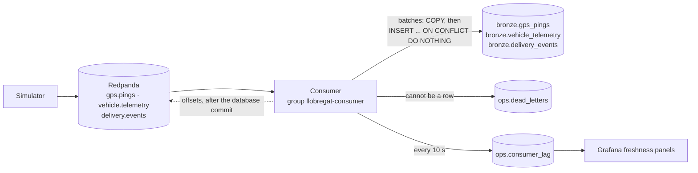

# Stream consumer

Writes what the vans send into TimescaleDB. It reads the three Redpanda topics of the
[simulator](../simulator/README.md), `gps.pings`, `vehicle.telemetry` and `delivery.events`, in
one consumer group, and writes them into `bronze.gps_pings`, `bronze.vehicle_telemetry` and
`bronze.delivery_events` in batches. A message it cannot store as a row goes to
`ops.dead_letters` with its raw bytes; every 10 seconds it records its lag and the newest
`event_time` it has written in `ops.consumer_lag`, for the freshness panels of Grafana.

It is a Compose service, so `docker compose up` (or `make up`) starts it with the platform and
restarts it if it stops (`restart: unless-stopped`). The tables are created by migration 013.

| Command | What it does |
|---|---|
| `make up` | Starts the platform, the consumer with it; it writes whatever the topics hold and then keeps up |
| `make logs s=consumer` | Its log: assignments, a status line every minute, every dead letter |
| `make test-consumer` | Runs the tests; the database tests run in scratch schemas when the platform is up, and are skipped when it is not |
| `make test-consumer-stream` | CI's integration check: sends a few valid and one malformed message per topic through the running consumer, checks bronze and the dead letters with SQL, then replays every topic. Leaves its test rows behind: for a throwaway stack |

## How it works



| Step | Rule |
|---|---|
| Reading | One consumer in the group `llobregat-consumer` owns the 9 partitions (3 per topic). A new group starts from the oldest message the topics keep (`auto.offset.reset=earliest`), so a stack that was down catches up on the last 24 hours |
| Batches | Written when 500 messages have arrived or one second after the first one, whichever comes first (`CONSUMER_BATCH_SIZE`, `CONSUMER_BATCH_WAIT_S`) |
| Writing | A batch is one transaction. Each table's rows are copied (`COPY`) into a temporary staging table and moved into bronze with one `INSERT ... SELECT ... ON CONFLICT DO NOTHING` on the table's key: `(vehicle_id, event_time)` for pings and telemetry, the handheld's `event_id` for scans. The dead letters go in the same transaction |
| Committing | The offsets of the batch are committed to the group only after the database has committed it. A crash in between reads the batch again, and the inserts write nothing twice: at-least-once delivery, every row once |
| A row the database refuses | If PostgreSQL refuses a row the parser let through (a JSON string holding `\u0000`, which `jsonb` cannot store, a number out of the range of its column), the batch is written again row by row, each in a savepoint; the refused rows become dead letters and the rest is written |
| Database down | The batch is retried with a growing pause for up to two minutes, then the consumer exits and Docker restarts it; nothing is committed meanwhile, so nothing is lost |
| Rebalance | A partition taken away is written and committed first; a partition lost without warning is dropped from the batch and read again by its new owner |
| Stopping | `docker compose stop` sends SIGTERM: the consumer writes and commits what it has read, and leaves the group |

### From message to row

Bronze is raw ([data model](../../docs/data-model.md#keys-and-constraints)): a message is stored as
it arrived unless it cannot be a row at all, and every field it carries is kept.

| Topic | Table | Key fields | Fields without a column go to |
|---|---|---|---|
| `gps.pings` | `bronze.gps_pings` | `vehicle_id`, `event_time` | `extra_fields` (JSON, `NULL` when there are none) |
| `vehicle.telemetry` | `bronze.vehicle_telemetry` | `vehicle_id`, `event_time` | `readings` (JSON): `charging`, `tyre_pressure_bar`, `engine_rpm`, `adblue_level_pct`, `cng_tank_pressure_bar` and any field a producer adds |
| `delivery.events` | `bronze.delivery_events` | `event_id`, `order_id`, `event_time` | `extra_fields` |

The metadata of ADR 0001, decision 20, arrive with the message or are added on the way in:

| Element | Where it comes from |
|---|---|
| `source` | The message, which names a key of `ops.data_sources` (`simulator/gps`, `simulator/telemetry`, `simulator/handheld`) |
| `event_time` | The message: when it happened, in the simulation's time |
| `schema_version` | The message's format version, 1, in a column of its own (migration 013). The table's version and its `owner` stay in the table comment |
| `ingested_at` | The database, when the batch's transaction started: `ingested_at - event_time` is the pipeline delay |

Values are not judged: a ping outside Catalonia, a negative speed or an unknown status is stored,
and silver's dbt tests flag it (issue #10). A message becomes a dead letter only for one of these
reasons, stored in `ops.dead_letters.reason` with the detail in `error`:

| Reason | When |
|---|---|
| `empty_message` | No value (a tombstone) |
| `invalid_json` | Not JSON, including `NaN` and `Infinity`, which Python would read but JSON does not have |
| `not_an_object` | JSON, but not an object |
| `missing_field` | A key field above, `source` or `schema_version` is absent, `null` or empty |
| `unsupported_schema_version` | A `schema_version` other than 1 |
| `invalid_field` | A value of a type its column cannot take: text where a number goes, 134.5 for an integer, a time without a time zone, an `event_id` that is not a UUID, text with a NUL character |
| `unknown_source` | A `source` not registered in `ops.data_sources` (the registry is read again, once a minute at most, before deciding) |
| `rejected_by_database` | PostgreSQL refused the row, as above |

A dead letter keeps the message as it arrived, `payload` and `message_key` as bytes, and where it
was: `topic`, `kafka_partition`, `kafka_offset` (the key, so a replay records it once) and
`kafka_timestamp`. The partition goes on: the offset is committed past it.

```sql
-- What was set aside, and why
SELECT topic, kafka_partition, kafka_offset, reason, error, encode(payload, 'escape') AS payload
FROM ops.dead_letters ORDER BY ingested_at DESC LIMIT 20;
```

`grafana_reader` can count dead letters and read their reason, error and place, but not
`payload` or `message_key`: a raw message carries what bronze carries, which the dashboards may not
read ([access](../../docs/data-model.md#access)).

### Lag and freshness

Every 10 seconds (`CONSUMER_LAG_INTERVAL_S`) the consumer writes one row per partition to
`ops.consumer_lag`: the group's committed offset, the partition's end offset, the lag between them
(messages not written yet), the newest `event_time` written from the partition and when a row from
it was last written. Grafana reads `ops`, so a panel can show both how far behind the consumer is
and how old the freshest data is:

```sql
-- The latest measurement of every partition
SELECT DISTINCT ON (topic, kafka_partition)
       topic, kafka_partition, lag, now() - last_event_time AS data_age, event_time AS measured_at
FROM ops.consumer_lag WHERE consumer_group = 'llobregat-consumer'
ORDER BY topic, kafka_partition, event_time DESC;
```

The table is a hypertable with one chunk per day, kept 30 days: it measures the pipeline and is
not raw data, so it has a retention policy where bronze has none. On restart the consumer reads its
last `last_event_time` per partition back from it.

The container answers `GET /health` on port 8000 (`CONSUMER_HEALTH_PORT`) with its status as JSON,
and the Compose healthcheck calls it. It answers 200 while the consumer owns partitions, has polled
the broker in the last 30 seconds and reached the database in the last 60, and 503 otherwise:

```bash
docker compose exec consumer python -c "import urllib.request; print(urllib.request.urlopen('http://localhost:8000/health').read().decode())"
```

```json
{"status": "ok", "uptime_s": 535, "assigned_partitions": 9, "seconds_since_poll": 0.2, "seconds_since_database": 2.2,
 "lag": 0, "messages": 271636, "inserted": {"vehicle_telemetry": 0, "delivery_events": 0, "gps_pings": 0},
 "duplicates": {"vehicle_telemetry": 37712, "delivery_events": 7644, "gps_pings": 226280}, "dead_letters": {},
 "commit_failures": 0}
```

That is the consumer after the replay below: every message of the day read again, none written twice.

The smoke test (`make smoke`) checks that the endpoint answers 200, that the lag of all three topics
was measured in the last minute and that it is at most 1,000 messages (`SMOKE_MAX_LAG`).

## Where it sits in the data lifecycle

| Phase | Here |
|---|---|
| Generation | The simulator drives the plan and publishes each van's pings every 5 s, telemetry every 30 s and the handheld's scans, as JSON keyed by vehicle |
| Ingestion | Redpanda keeps each message 24 hours; the consumer turns each one into a typed row, semi-structured in transit, structured at rest ([phase 2](../../docs/phases/2-classification.md)) |
| Storage | Bronze hypertables, one chunk per day, compressed to the columnstore after a day and never dropped until the archiving job exists (issue #20): the row is the only copy of a stream message once the topic lets it go. What could not be a row is kept in `ops.dead_letters` |
| Processing | dbt builds silver and the KPI from bronze (issue #10); the freshness of its input is in `ops.consumer_lag` |

## 28 September 2026, ingested

The simulated day of the [simulator's README](../simulator/README.md#28-september-2026-driven), read
from the topics by the consumer on the running stack on 29 September 2026:

| Topic | Messages in the topic | Rows in bronze | Dead letters |
|---|---|---|---|
| `gps.pings` | 226,280 | 226,280 | 0 |
| `vehicle.telemetry` | 37,712 | 37,712 | 0 |
| `delivery.events` | 7,644: 2,548 `out_for_delivery`, 2,548 `arrived`, 2,292 `delivered`, 256 `failed` | 7,644, the same by status | 0 |

The consumer group was then sent back to the start of every topic (`rpk group seek
llobregat-consumer --to start`) and the consumer read the 271,636 messages again in under 30
seconds, its start included: 0 rows inserted, 271,636 already there, 0 dead letters, and the newest
`ingested_at` of each table unchanged. The same messages produced into an empty throwaway stack were
written in 40 seconds, about 6,800 messages a second, with the database in memory; the simulator
sends the day at `SPEED=120` at about 550 a second.

The KPI from bronze alone, departure as the first ping of a route outside the hub geofence and
completion as its last `delivered` or `failed` scan, gives the simulator's own figures:

| Wave | Routes | Average delivery time per route | Shortest | Longest |
|---|---|---|---|---|
| Morning | 30 | 429 min | 270 min | 558 min |
| Afternoon | 10 | 423 min | 389 min | 457 min |
| All | 40 | 427 min | 270 min | 558 min |

```sql
WITH hub AS (SELECT lat, lon, geofence_radius_m FROM bronze.hubs WHERE hub_id = 'BCN-ZF'),
pings AS (
  SELECT p.route_id, p.event_time, h.geofence_radius_m,
         2 * 6371000 * asin(sqrt(power(sin(radians(p.lat - h.lat) / 2), 2)
             + cos(radians(h.lat)) * cos(radians(p.lat)) * power(sin(radians(p.lon - h.lon) / 2), 2))) AS from_hub_m
  FROM bronze.gps_pings p CROSS JOIN hub h
  WHERE p.route_id LIKE 'R-20260928-%'),
departed AS (SELECT route_id, min(event_time) AS departed_at FROM pings WHERE from_hub_m > geofence_radius_m GROUP BY 1),
completed AS (
  SELECT route_id, max(event_time) AS completed_at FROM bronze.delivery_events
  WHERE route_id LIKE 'R-20260928-%' AND status IN ('delivered', 'failed') GROUP BY 1)
SELECT route_id, departed_at, completed_at, round(extract(epoch FROM completed_at - departed_at) / 60) AS minutes
FROM departed JOIN completed USING (route_id) ORDER BY route_id;
```

## Settings

| Variable | Default | Meaning |
|---|---|---|
| `KAFKA_BOOTSTRAP` | `localhost:19092` | Redpanda's Kafka API; inside Compose `redpanda:9092` |
| `CONSUMER_GROUP` | `llobregat-consumer` | The consumer group, whose offsets say what has been written |
| `CONSUMER_BATCH_SIZE` | `500` | Messages per batch at most |
| `CONSUMER_BATCH_WAIT_S` | `1` | Seconds a batch waits for more messages after its first |
| `CONSUMER_LAG_INTERVAL_S` | `10` | Seconds between two lag measurements |
| `CONSUMER_HEALTH_PORT` | `8000` | Port of the health endpoint, inside the container |
| `POSTGRES_*` | as for the [generator](../generator/README.md#how-to-run) | TimescaleDB; inside Compose `timescaledb:5432` |

Outside Docker, with the platform up and the Compose consumer stopped (two consumers in one group
share the partitions):

```bash
set -a && . ./.env && set +a
uv run --project services/consumer --frozen llobregat-consumer
```

## Tests

`make test-consumer` runs 66 tests. Offline, with no broker or database, they check the parsing and
validation of each topic (every field kept, the sensors in `readings`, the fields without a column
in `extra_fields`, values stored unjudged, and every reason for a dead letter), and the loop against
a fake broker and a fake database: batches by count and by time, offsets committed only after the
database and never while it is down, a short outage retried, dead letters that do not block the
partition, a source registered after the start, the lag per partition, the health report, a
rebalance and the stop. With the platform up, the database tests write into a scratch schema whose
tables are copies of the real ones: every field lands in its column, a replayed batch or a key sent
twice writes nothing twice, a dead letter keeps its bytes, a row the database refuses is set aside
while the rest of its batch is written, and the lag is read back per partition. CI runs the offline
tests in the Python job and all of them, then `scripts/consumer-stream-test.sh`, in the compose job.
